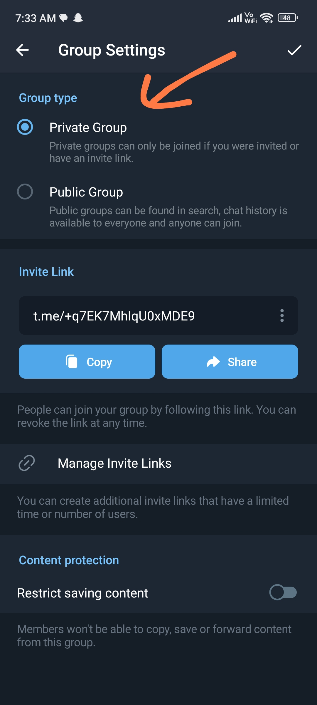
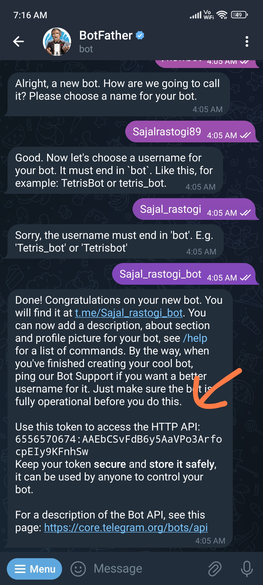
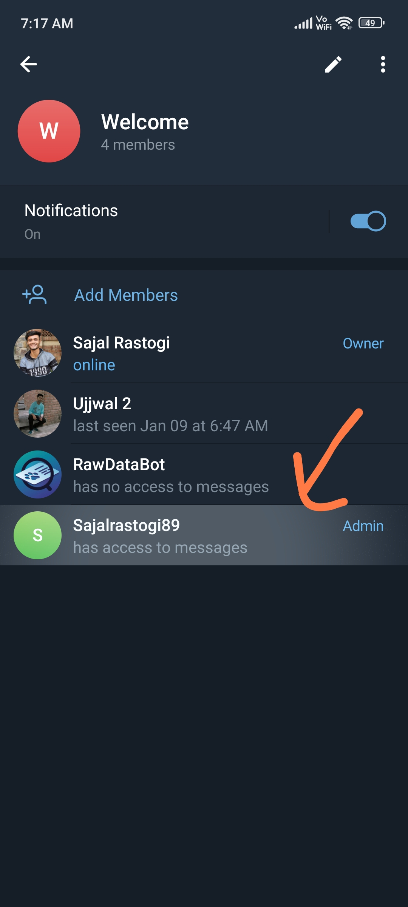
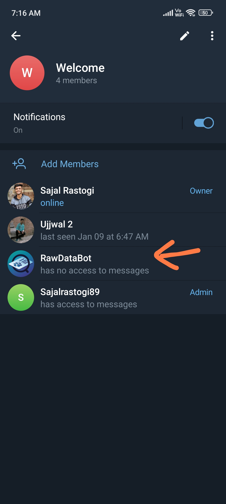
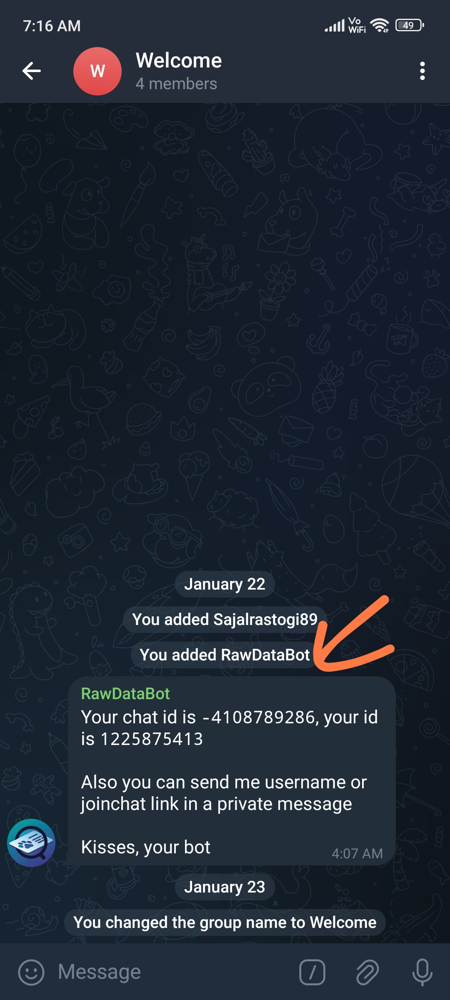
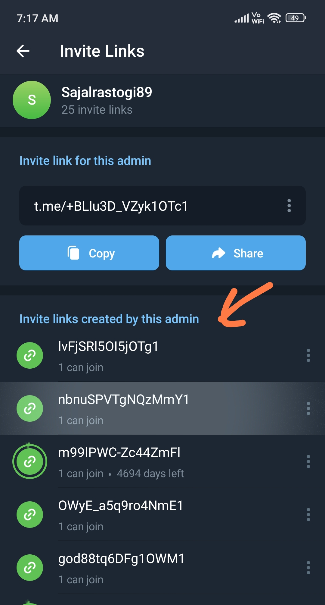

# Telegram Channel Invite Link Generator with 1 member limit

## Main Objective
I have created a service to simplify the process of automatically adding people to a private group. The API takes the chatid and tokenid as input and returns an invite link with a member limit of one. The generated link expires after one member has joined, streamlining the process of adding individuals to a private group. This API is designed for legitimate use, ensuring that only authorized individuals can access the generated invite link. Use this service in your backend projects to directly create groups of authorized persons.

## Application
For example, if a website is developed for a teacher and only those who have paid can access the course, this API can be called right after a successful payment. The API returns an invite link with a member limit of one, ensuring that only the paying student can join. This eliminates the need for developing a separate group chat feature on the teacher's website, leveraging Telegram for this purpose.

## Steps to Use

### 1. Create a Private Group

Create a private Telegram group on your account.



### 2. Create a Bot Using Godfather

- Search for the Godfather bot on Telegram and start a chat.
- Use the `/newbot` command to create a new bot. Follow the instructions provided by Godfather to set up your bot.
- Once the bot is created, Godfather will provide you with a unique API token. Save this token for later use.


*Screenshot of creating a bot using Godfather and obtaining the API token.*

### 3. Add the Bot to Your Group

- Add the bot you just created to your private group. Make sure to add the bot as an administrator with sufficient privileges.
- Additionally, add the `rawDatabot` to your group. This bot will automatically provide you with the chat ID.

        


### 4. Obtain API Token and Chat ID

You now have two essential pieces of information:
- **API Token**: The token provided by the bot created using Godfather.
- **Chat ID**: Obtained from the `rawDatabot` in your group.

### 5. Use the API

Make a POST request to the following API endpoint to generate an invite link:

```http
POST http://localhost:8080/link/apiToken/{apiToken}/chatId/{chatId}
```

### 6. Generated Links with 1 member limit

